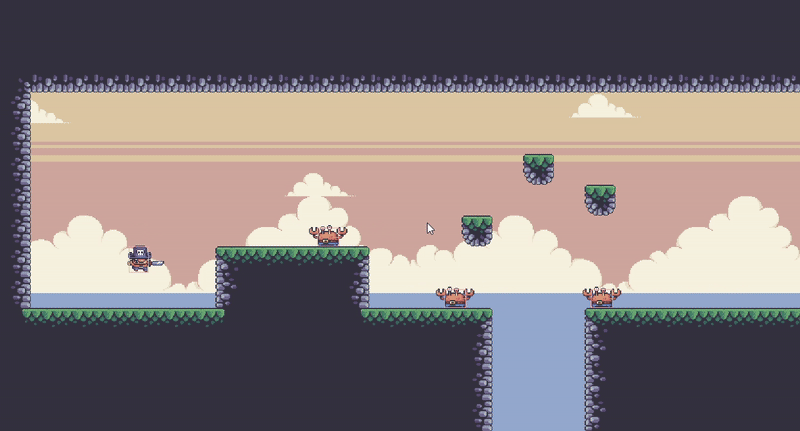
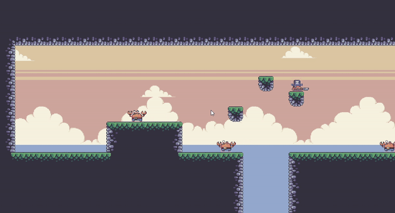

# 🎮 Java 2D Platformer Engine

_A functional 2D game framework built with Java Swing/AWT featuring:_

- 120 FPS rendering with fixed-update game loop
- Basic entity-component architecture
- Tile-based levels with collision detection
- Simple state management for game flow

## 🛠️ Technical Implementation

### Core Systems

- **Rendering**

  - Sprite animation system with atlas support
  - Basic camera following for level navigation
  - Debug visualization for hitboxes

- **Physics**

  - AABB collision handling
  - Custom jump/gravity parameters
  - Slope detection for platform edges

- **AI**
  - State-based enemy behaviors
  - Basic patrol and chase routines
  - Line-of-sight checks

## 🎥 Media

<div align="center" style="gap: 20px; display: flex; justify-content: center;">
  
   
</div>

## 📦 Project Structure

```
src/
├── entities/ # Player, enemies, and entity logic
├── gamestates/ # Menu, Playing, Pause states
├── inputs/ # Keyboard and mouse handlers
├── levels/ # Tilemap loading and rendering
├── main/ # Core game loop and window
├── ui/ # User interface components
└── utils/ # Helper classes and utilities
```

## 🚀 Building

```bash
# Compile all Java files
javac -d bin src/main/*.java src/entities/*.java src/levels/*.java src/utils/*.java src/gamestates/*.java src/inputs/*.java src/ui/*.java

# Run the game
java -cp bin main.MainClass
```

**Requirements:**

- Java 17 JDK
- IDE (Eclipse/IntelliJ) optional

**For IDE setup:**

1. Create new Java project
2. Set source folder to `src/`
3. Add all package directories
4. Run `main.MainClass`

## 🔜 Possible Extensions

- Improved collision optimization
- Expanded enemy behaviors
- Sound effect integration
- Additional game states

---

<sub>Demonstrates: Java OOP | Game Architecture Fundamentals | Swing/AWT Proficiency</sub>
